# Tetris3D

3D Tetris s využitím rozšírenej reality!

## O čom to je?

Tetris3D je 3D verzia hry Tetris s využitím rozšírenej reality.
Pravidlá sú podobné ako v Tetris-e. Generujú sa tetrominá (tieto 
však nepadajú zhora, ale sa objavujú vždy na jednom rohu kockovej 
mriežky). Následne treba tieto tetrominá ukladať do 3D mriežky a 
vypĺňať vrstvy -- rezy kocky v smere jej rovín $xy$, $xz$ a $yz$, 
kde $x$, $y$ a $z$ sú osi. 

## Ako to vyzerá?

### Prostredie a tetrominá

**Mriežka** je 3D kocka, zložená z menších kociek, ktoré majú nastavenú 
transparentnú farbu. 

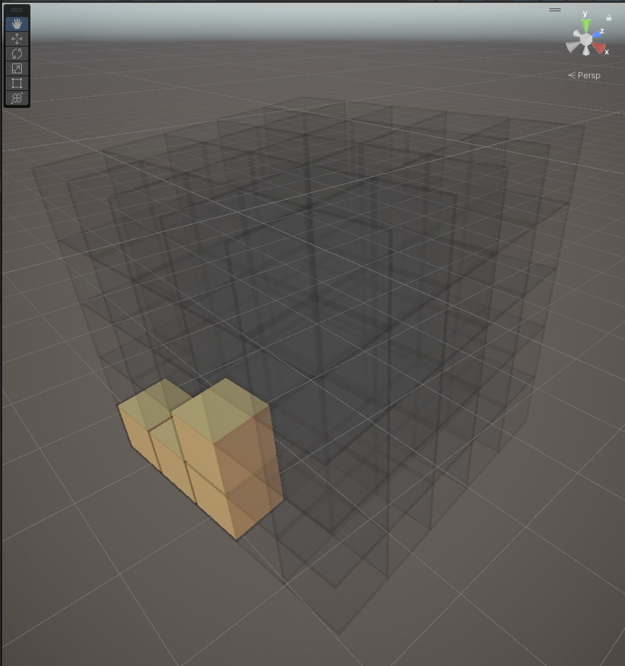

**Tetromino** je jeden Tetris-ový dielik, zložený zo 4 blokov. V našej 
verzii Tetrisu máme 4 typy, a to:

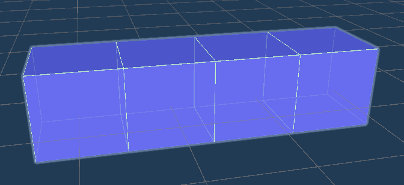
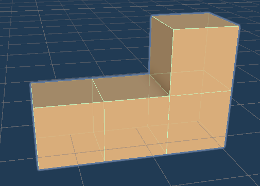
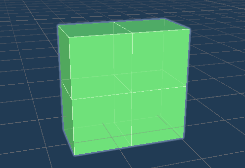
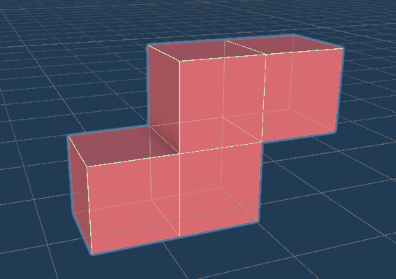

### Skutočná hra

[Videoukážka](https://drive.google.com/file/d/1xZfDacsf6R30y_WMxMYX7o__F5bVwOpm/view?usp=sharing)

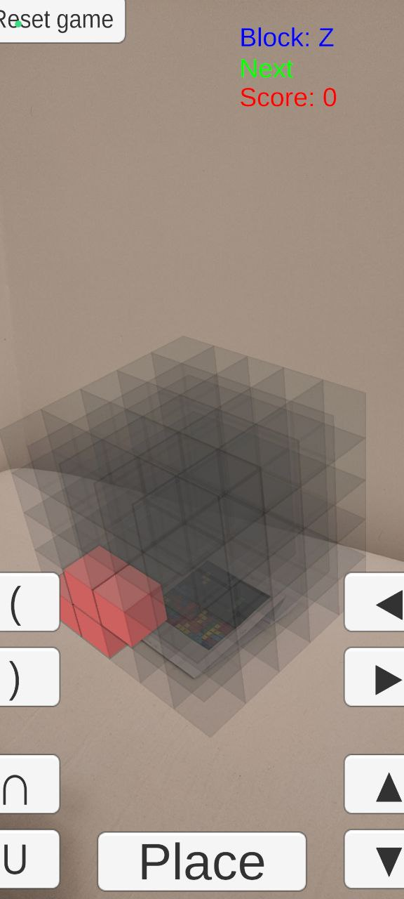

## Ovládanie

Tetrominá treba posúvať a otáčať. Na to aby sa to dalo robiť, hráč 
využíva tlačítka a fyzický pohyb okolo markera -- konkrétne, smer 
pohľadu na zobrazenú mriežku. 

### Tlačítka pohybu

Hráč má k dispozicii dve tlačítka na pohyb hore a dolu v mriežke 
a dve tlačítka na pohyb do strán -- doľava, doprava. Ale v 3D 
priestore sa potrebujeme vedieť hýbať v troch osiach. To je 
vyriešené tým, že sa hráč hýbe okolo kocky (fyzického markera) 
samotnej. Smery vľavo a vpravo posúvajú tetromino len v rovine 
steny mriežky, na ktorú sa hráč práve pozerá (konkrétnejšie tej, 
ktorá je pre neho najviac viditeľná). Takže, ak sa pozerá na prednú 
stenu kocky (v rovine rovnobežnej s $xy$), tak sa tetromino hýbe 
po osi $x$. Ak sa ale pozerá na ľavú stranu kocky (rovnobežnú s 
rovinou $yz$), tak sa tetromino hýbe po osi $z$. 

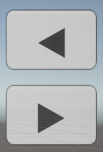
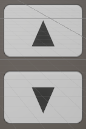

### Tlačítka rotácie

Tetrominá sa taktiež dajú rotovať. Opäť sú k dizpozícii rotácie 
len v dvoch smeroch a pre rotáciu po tretej osi sa musí hráč 
fyzicky hýbať okolo markera. 

Je dobré poznamenať, že sa tetrominá rotujú okolo svojho "prvého" 
bloku, t.j. blok, ktorý máme v prefabe daného tetromina zadaný 
ako prvý. Taktiež, ak tetromino nemá do daného smeru na vykonanie 
rotácie dostatok miesta, tak sa neotočí. Čiže, ak sa zdá, že rotácie 
nefungujú, tetromino má len málo miesta na otočenie a treba ho poposúvať 
do správnych smerov, aby sa vytvorilo miesto.

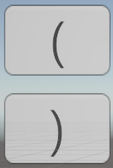
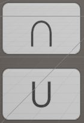

### Umiestnenie bloku

Keď hráč poposúva a pootáča tetromino, treba uložiť jeho polohu v 
mriežke. Na to slúži tlačítko `Place`. To uloží aktuálnu polohu 
tetromina a hneď na to sa vygeneruje nové tetromino.

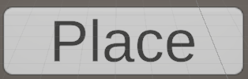

> _V prípade, že sa tetromino nedá umiestniť, posunúť do nejakého smeru 
alebo zrotovať do nejakého smeru, tak tlačítka prebliknú na červeno. 
Naopak, pri úspešnej akcii preblikne na zeleno._ 

## Požiadavky

Na zobrazovanie hry v AR treba [marker](Static/tetrisMarker.jpg) a na 
snímanie markera hra využíva [Vuforiu](https://developer.vuforia.com/downloads/sdk) 
(ver. 10.27.3) -- po stiahnutí treba stiahnutý archív pridať do priečinka 
`Packages`. Hra bola vytvorená v [Unity](https://unity.com/releases/editor/whats-new/2022.3.48) 
(ver. 22.3.48f1).

